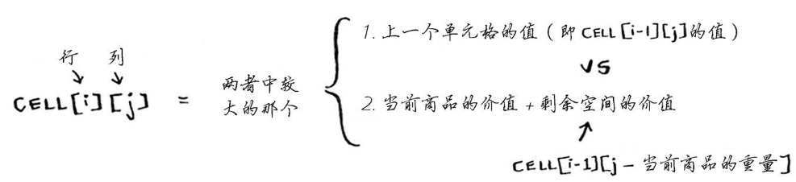

## 概述
动态规划（Dynamic programming，简称 DP）是一种在数学、管理科学、计算机科学、经济学和生物信息学中使用的，通过把原问题分解为相对简单的子问题的方式求解复杂问题的方法。

动态规划常常适用于有重叠子问题和最优子结构性质的问题，并且记录所有子问题的结果，因此动态规划方法所耗时间往往远少于朴素解法。

动态规划有自底向上和自顶向下两种解决问题的方式。自顶向下即**记忆化递归**，自底向上就是**递推**。

使用动态规划解决的问题有个明显的特点，一旦一个子问题的求解得到结果，以后的计算过程就不会修改它，这样的特点叫做无后效性，求解问题的过程形成了一张有向无环图。动态规划只解决每个子问题一次，具有天然剪枝的功能，从而减少计算。

动态规划对每个单元格计算其最大价值的公式为：




动态规划当中包含三种重要概念：
**最优子结构**、**边界**、**状态转移公式**。对于一个适用动态规划解决的问题，我们可以通过问题建模找到以上三个要素，从而帮助解决问题。

## 背包问题思考
1. 可以偷商品的一部分吗？
答案是不可以。
使用动态规划时，要么考虑拿走整件商品，要么考虑不拿，而没法判断该不该拿走商品的一部分。

2. 动态规划可以处理相互依赖的子问题吗？
不可以。
动态规划功能强大，它能够解决子问题并使用这些答案来解决大问题。
但仅当每个子问题都离散的，即不依赖于其他子问题时，动态规划才管用。

3. 最优解可能导致背包没有被装满吗？
可能。
加入你还可以偷一颗钻石。

## 最长公共子串

### 动态规划的特性
* 动态规划可以帮助你在给定约束条件下找到最优解。
* 在问题可分解为彼此离散的子问题时，就可使用动态规划来解决问题。
* 每种动态规划解决方案都涉及网络。
* 单元格中的值通常就是你需要优化的值。
* 每个单元格都是一个子问题，因此你应考虑如何将问题分成子问题，这有助于你找出网格的坐标轴。

### 最长公共子串问题
对于最长公共子串问题而言，需要找到两个字符串中最长的公共子串。举例两个字符串为：hish和vista。

因此可将两个字符串的字母作为坐标，而其最长子串长度为单元格内的值。


由于目标为最长子串，因此必须是连续的。
伪代码如下：
```Swift
if word_a[i] == word_b[j] { 
    // 两个字母相同
    cell[i][j] = cell[i-1][j-1] + 1
} else { 
    // 两个字母不同，则子串结束，单元格置零
    cell[i][j] = 0
}
```

## 最长公共子序列
[Leetcode 1143. 最长公共子序列](https://leetcode.cn/problems/longest-common-subsequence/)

给定两个字符串 text1 和 text2，返回这两个字符串的最长 公共子序列 的长度。如果不存在 公共子序列 ，返回 0 。

一个字符串的 子序列 是指这样一个新的字符串：它是由原字符串在不改变字符的相对顺序的情况下删除某些字符（也可以不删除任何字符）后组成的新字符串。

例如，"ace" 是 "abcde" 的子序列，但 "aec" 不是 "abcde" 的子序列。
两个字符串的 公共子序列 是这两个字符串所共同拥有的子序列。

示例 1：
> 输入：text1 = "abcde", text2 = "ace" 
> 
> 输出：3  
> 
> 解释：最长公共子序列是 "ace" ，它的长度为 3 。

示例 2：
> 输入：text1 = "abc", text2 = "abc"
> 
> 输出：3
> 
> 解释：最长公共子序列是 "abc" ，它的长度为 3 。

示例 3：
> 输入：text1 = "abc", text2 = "def"
> 
> 输出：0
> 
> 解释：两个字符串没有公共子序列，返回 0 。
 
提示：
* 1 <= text1.length, text2.length <= 1000
* text1 和 text2 仅由小写英文字符组成。

最长公共子序列相比于最长公共子串可能更能够得到字符串间的相似度。
其所比较的内容为：两个单词中都有的序列包含的字母数。这个问题的解答更类似于背包问题。
由于不再要求连续，仅需要相同的字符序列越多越好。


伪代码如下：
```Swift
if word_a[i] == word_b[j] { 
    // 两个字母相同
    cell[i][j] = cell[i-1][j-1] + 1
} else { 
    // 两个字母不同，子序列仍可继续，单元格取左或者上方向的最大值
    cell[i][j] = max(cell[i-1][j], cell[i][j-1])
}
```

我们可以使用动态规划进行问题建模
* 边界：`cell[0][0] = word_a[i] == word_b[j] ? 1 : 0`
* 最优子结构：`cell[5][6] = max(cell[4][6], cell[5][5])`
* 状态转移方程：`if text1Arr[i - 1] == text2Arr[j - 1] { res[i][j] = res[i-1][j-1] + 1 } else { res[i][j] = max(res[i-1][j], res[i][j-1]) }`

Swift实现
```Swift
func longestCommonSubsequence(_ text1: String, _ text2: String) -> Int {
    let m = text1.count
    let n = text2.count
    
    var res = [[Int]](repeating: [Int](repeating: 0, count: n + 1), count: m + 1)

    var text1Arr = text1.utf8CString
    var text2Arr = text2.utf8CString
    text1Arr.removeLast()
    text2Arr.removeLast()
    
    for i in 1...m {
        for j in 1...n {
            if text1Arr[i - 1] == text2Arr[j - 1] {
                res[i][j] = res[i-1][j-1] + 1
            } else {
                res[i][j] = max(res[i-1][j], res[i][j-1])
            }
        }
    }
    
    return res[m][n]
}
```

## 练习
9.1 假设你还可偷另外一件商品——MP3播放器，它重1磅，价值1000美元。你要偷吗？
> 要。在这种情况下，可以选择MP3、iPhone和吉他，总价值为4500美元。

9.2 假设你要去野营。你有一个容量为6磅的背包，需要决定该携带下面的哪些东西。其中每样东西都有相应的价值，价值越大意味着越重要：
* 水（重3磅，价值10）；
* 书（重1磅，价值3）
* 食物（重2磅，价值9）；
* 夹克（重2磅，价值5）；
* 相机（重1磅，价值6）。
请问携带哪些东西时价值最高？
> 携带水、食物和相机。

9.3 请绘制并填充用来计算blue和clues最长公共子串的网格。
|-|C|L|U|E|S|
|--|--|--|--|--|--|
|B|0|0|0|0|0|
|L|0|1|0|0|0|
|U|0|0|2|0|0|
|E|0|0|0|3|0|


## 小结 
* 需要在给定约束条件下优化某种指标时，动态规划很有用。
* 问题可分解为离散子问题时，可使用动态规划来解决。
* 每种动态规划解决方案都涉及网格。
* 单元格中的值通常就是你要优化的值。
* 每个单元格都是一个子问题，因此你需要考虑如何将问题分解为子问题。
* 没有放之四海皆准的计算动态规划解决方案的公式。

## 应用于拓展
[Leetcode 70. 爬楼梯](https://leetcode.cn/problems/climbing-stairs/)
假设你正在爬楼梯。需要 n 阶你才能到达楼顶。
每次你可以爬 1 或 2 个台阶。你有多少种不同的方法可以爬到楼顶呢？

示例 1：
> 输入：n = 2
> 
> 输出：2
> 
> 解释：有两种方法可以爬到楼顶。
> 
> 1. 1 阶 + 1 阶
> 
> 2. 2 阶

示例 2：
> 输入：n = 3
> 
> 输出：3
> 
> 解释：有三种方法可以爬到楼顶。
> 
> 1. 1 阶 + 1 阶 + 1 阶
> 
> 2. 1 阶 + 2 阶
> 
> 3. 2 阶 + 1 阶

提示：
> 1 <= n <= 45

本题可运用动态规划的思想，采用自下而上的递推方式找出规律。
先确定爬1级和2级台阶时有几种方法，再递推出从第3极开始，爬楼梯的方法种数由前两次结果决定。

问题建模
* 边界：`f(1) = 1, f(2) = 2`
* 最优子结构：`f(10) = f(9) + f(8)`
* 状态转移方程：`f(n) = f(n - 1) + f(n - 2)`

```Swift
func climbStairs(_ n: Int) -> Int {
    if n < 0 {
        return 0
    }
    
    if n == 1 {
        return 1
    }
    
    if n == 2 { 
        return 2
    }
    
    var a = 1
    var b = 2
    var res = 0
    
    for _ in 3...n {
        res = a + b
        a = b
        b = res
    }
    
    return res
}
```
